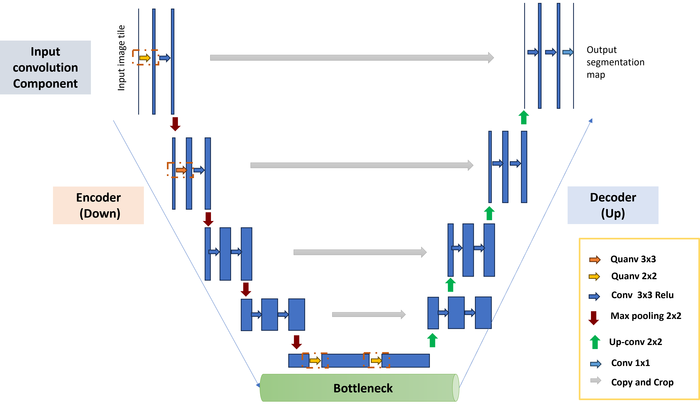
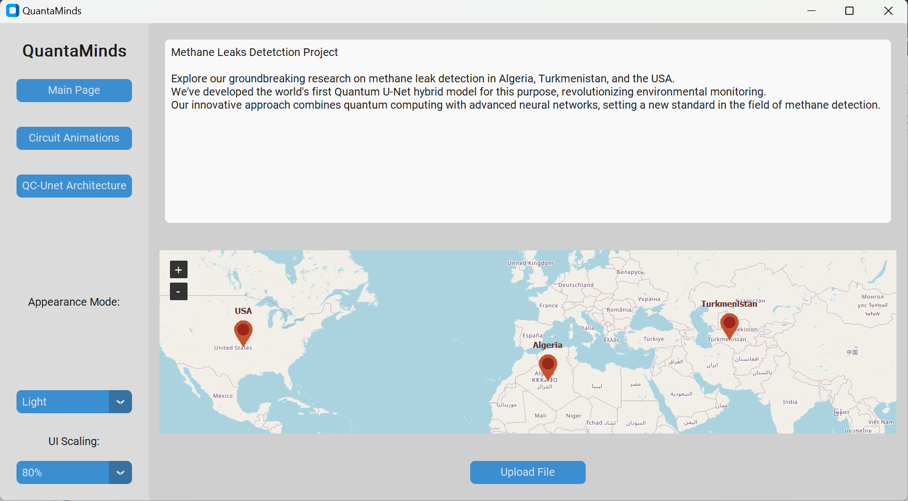
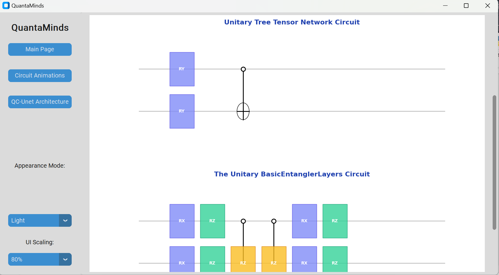

# Quantum-AI-for-Climate

Womanium Quantum+AI 2024 Projects

**Please review the participation guidelines [here](https://github.com/womanium-quantum/Quantum-AI-2024) before starting the project.**

_**Do NOT delete/ edit the format of this read.me file.**_

_**Include all necessary information only as per the given format.**_

## Project Information:

### Team Size:

- Maximum team size = 4
- While individual participation is also welcome, we highly recommend team participation :)

### Eligibility:

- All nationalities, genders, and age groups are welcome to participate in the projects.
- All team participants must be enrolled in Womanium Quantum+AI 2024.
- Everyone is eligible to participate in this project and win Womanium grants.
- All successful project submissions earn the Womanium Project Certificate.
- Best participants win Womanium QSL fellowships with NNL. Please review the eligibility criteria for QSL fellowships in the project description below.

### Project Description:

- Click [here](https://drive.google.com/file/d/1yoY_venPkNStjcDu0Na0HYhgO6CvVYdM/view?usp=sharing) to view the project description.
- YouTube recording of project description - [link](https://youtu.be/ka2RgUYo83c?si=MUb_dwTVfP1FV_47)

## Project Submission:

All information in this section will be considered for project submission and judging.

Ensure your repository is public and submitted by **August 9, 2024, 23:59pm US ET**.

Ensure your repository does not contain any personal or team tokens/access information to access backends. Ensure your repository does not contain any third-party intellectual property (logos, company names, copied literature, or code). Any resources used must be open source or appropriately referenced.

### Team Information:

Team Member 1:

- Full Name: Widad Hassina Belkadi
- Womanium Program Enrollment ID (see Welcome Email, format- WQ24-xxxxxxxxxxxxxxx): WQ24-OtLEQXfn7uFF7it

Team Member 2:

- Full Name: Rihab Hoceini
- Womanium Program Enrollment ID (see Welcome Email, format- WQ24-xxxxxxxxxxxxxxx): WQ24-KPzWzHDZHFx44iX

Team Member 3:

- Full Name: Radhia Djebrouni
- Womanium Program Enrollment ID (see Welcome Email, format- WQ24-xxxxxxxxxxxxxxx): WQ24-1GmcuhBW28GqKvj

Team Member 4:

- Full Name: saif Nazzim asi
- Womanium Program Enrollment ID (see Welcome Email, format- WQ24-xxxxxxxxxxxxxxx): WQ24-gIrIRKL5nfC9MOl

### Project Solution:

_Hybrid Quantum Classical U-net for Methane leaks detection_.

This project was developed as part of the Womenium AI+Quantum program. We selected the Quantum-AI-for-Climate project, focusing on leveraging quantum technologies and artificial intelligence to detect methane leaks and plumes. We are proud to announce the successful completion of the four designated tasks.
The report is in [Report](docs/report.pdf). Below, you will find the detailed descriptions for each task presented in the report in detail:

- Task A: This task involves a statement of the problem and background information, detailed in Chapter 1: Background.
- Task B: This task includes a brief overview of the background research and literature reviews conducted by our team, presented in Chapter 2: Literature Review. Additionally, Chapter 3: Materials outlines the resources we utilized to develop our solution.
- Task C: In this task, we describe how AI and Quantum methods can be employed to address the problem. Chapter 4: Conception details our methodology and solution, while Chapter 5: Experiments and Results presents the experiments conducted and their outcomes.
- Task D: This task focuses on the application of our solution, as discussed in Chapter 6: Application.

The classical model is based on the work of du Baret, B., Finos, S., Guiglion, H., & Wilson, D. (2023). Methane Plume Detection with U-Net Segmentation on Sentinel-2 Image Data. NeurIPS 2023 Workshop on Tackling Climate Change with Machine Learning. Retrieved from https://www.climatechange.ai/papers/neurips2023/78.

The quantum QC-Unet model is our proposed architetcure. However, we used some code of [This repository](https://github.com/takh04/QCNN/tree/main?tab=readme-ov-file) to construct the QCNN circuit.

The link to [the google docs report](https://docs.google.com/document/d/1Dw4HXiROUrcbNnedyXjFgDRoc4D8Abdis47zs3Eb7dA)

**1. Important Note about the Data:**

Due to connexion issues and the big volume of the data we couldn't upload the data, but you can download it from here : [drive link](https://drive.google.com/drive/folders/1hm1VxLvFvtSizUXlWb5coSCimAT1roLH) or from [github link](https://github.com/sfinos316/Methane-Plume-Segmentation/tree/main/data) the folder must be placed in 'src/' and have the name data.

`data/`: Train Dataset + Test Dataset

Each dataset containing :

`input_tiles/` : tiles used for the input

`output_matrix/` : matrix containing the polygons used as a label

`tci_tiles/` : true color tiles

**2. Overview of the QCU-net architetcure**

**3. Overview of the application:**

**4. Code Content:**

The full code and data are available in this respository and structed as follows:

- in the '/src' folder you will find the code related to the mdata processing, models, evaluation...

  - The notebook represents the 'main' functions
    - data_visualizations.ipynb: contains visualizations of our data.
    - Benchmarking.ipynb:
    - Drawing_circuits.ipynb:
    - Results_visualizations:
  - The .py represent our packages used in the notebooks.
    - data related:
      - data.py: to preprocess the data.
      - subdataset.py: to create the subdataset.
    - models related:
      - classical: classical_unet.py
      - quantum: QCUnet.py, QCUBottleNeck.py, unitary.py,
      - training: train.py
  - The folder circuit_visualizations contains some circuit mpl draw using pennyLane.
  - The folder mod: contains the saved models
  - The folder results: contains the dataframes, containing the evaluation metrics for each model or the architetcures.
  - The folder subdata: contains the files containing the image names that we took in our subdataset.

- in the '/app' folder you will find the code related to the demo app.

### Project Presentation Deck:

[PPT Presentation slides](https://docs.google.com/presentation/d/1REZs52omkWnfaxQTyJs6VvPOhEX4L3rshtrgaKsRbt8/edit?pli=1#slide=id.g25703cb3a7b_0_64).

[PPT Presentation PDF](https://drive.google.com/file/d/1-O9vmn9CDanobpNWfwIq0vYG3Z0NenVL/view?usp=drive_link).

[Report pdf](https://drive.google.com/file/d/1rXGJMoyUYmdu_G9FX5QVfDrSvaZ3LJmV/view?usp=drive_link)

[Report docs](https://docs.google.com/document/d/1Dw4HXiROUrcbNnedyXjFgDRoc4D8Abdis47zs3Eb7dA)
